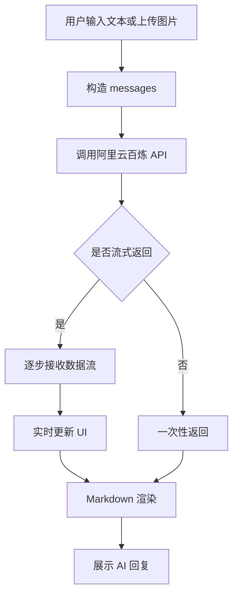

## 一、项目基本信息

* 项目名称：仿 WPS 灵犀 AI 对话助手
---

## 二、项目简介

本项目是一个基于 **HTML + CSS + JavaScript 原生实现** 的 AI 对话助手，整体风格参考 WPS 灵犀产品。

项目接入了 **阿里云百炼大模型 API**，实现了真实的 AI 对话能力，并支持流式响应、Markdown 渲染、主题切换、图片上传等功能，具备完整的前端交互体验。

---

## 三、开发任务索引（已完成）

本项目已完成以下核心功能：

### 1. 首页功能

* 渐变标题（Gradient Text）
* 欢迎文案展示
* 4 张快捷建议卡片（带图标）
* 点击卡片可直接发送对话

---

### 2. 对话功能

* 接入阿里云百炼 API，实现真实 AI 对话
* 用户消息靠右显示，AI 消息靠左显示（带头像）
* 流式输出（打字机效果）
* 首次对话后自动隐藏欢迎页

---

### 3. Markdown 渲染

* 使用 `marked.js` 解析 Markdown
* 支持：

  * 标题
  * 列表
  * 表格
  * 引用
  * 代码块
* 使用 `highlight.js` 实现代码高亮
* 代码块支持「复制」按钮

---

### 4. 主题切换

* 支持深色 / 浅色模式切换
* 使用 `class + CSS变量` 实现主题控制
* 使用 `localStorage` 持久化主题状态

---

### 5. 输入区功能

* 输入框固定底部
* 无内容时隐藏发送按钮
* 支持 Enter 发送、Shift+Enter 换行
* 支持图片上传
* 上传图片可本地预览
* 图片支持点击放大查看
* 支持停止生成（中断流式请求）
* 支持清空对话并返回首页

---

### 6. API Key 管理

* 使用 `localStorage` 存储 API Key（键名：`LINGXI_API_KEY`）
* 页面首次加载自动检测并提示输入
* 未上传任何敏感信息到代码仓库

---

## 四、核心技术实现

### 1. 流式交互实现（核心亮点）

通过阿里云百炼的 `stream: true` 接口，实现 AI 返回内容的流式传输：

* 使用 `fetch + ReadableStream` 读取数据流
* 按行解析 `data:` 格式数据
* 实时拼接内容并更新 UI
* 实现类似 ChatGPT 的打字机效果

---

### 2. Markdown 结构化渲染

* 使用 `marked.js` 将 AI 返回的 Markdown 转为 HTML
* 使用 `highlight.js` 对代码块进行语法高亮
* 动态插入代码工具栏，实现「复制代码」功能

---

### 3. 图片上传与预览机制

* 使用 `<input type="file">` 选择图片
* 使用 `URL.createObjectURL()` 生成本地预览地址
* 在发送前展示缩略图（预览区）
* 发送后作为聊天消息展示
* 点击图片可触发全屏预览（overlay）

⚠️ 避免过早调用 `URL.revokeObjectURL()`，否则图片会失效

---

### 4. 状态管理设计

在交互中统一管理多个状态：

* 是否正在生成（isGenerating）
* 是否有输入内容
* 是否有图片

通过统一控制：

* 发送按钮显示/隐藏
* 停止按钮逻辑
* 上传按钮状态

避免多入口（输入框 / 卡片）导致逻辑混乱

---

### 5. 主题系统实现

* 使用 `body.theme-light / theme-dark` 控制主题
* 所有颜色通过 CSS 变量定义
* 切换主题时动态修改 class
* 保证不同组件（卡片、气泡、代码块）统一适配

---

## 五、遇到的问题与解决思路

### 1. 消息对齐问题

问题：用户消息与输入框位置不一致
原因：未正确理解 flex 布局和父子容器关系

解决：

* 统一使用 flex 布局
* 明确 `justify-content` 和 `align-items` 的作用

---

### 2. 主题切换样式不统一

问题：切换亮色后部分组件仍是暗色

解决：

* 使用 CSS 变量统一管理颜色
* 避免写死颜色值

---

### 3. 卡片发送与按钮逻辑不一致

问题：点击卡片发送时没有正确进入“生成状态”

解决：

* 将发送逻辑统一封装到 `sendMessage`
* 所有入口复用同一逻辑

---

### 4. 图片发送后消失

问题：发送后图片无法显示

原因：

* 调用了 `URL.revokeObjectURL()` 导致 URL 失效

解决：

* 延迟释放或不释放
* 发送前缓存 imageUrl

---

### 5. 图片无法被 AI 识别

问题：上传图片但 AI 无法理解内容

原因：

* 使用的是文本模型（qwen-flash）
* 未传递 image_url

解决：

* 切换为视觉模型 `qwen3-vl-flash`
* 按多模态格式构造 messages

---

## 六、项目亮点总结

* 实现了类 ChatGPT 的流式交互体验
* 支持 Markdown + 代码高亮 + 复制功能
* 图片上传 + 本地预览 + 点击放大
* 完整的状态管理（发送 / 生成 / 停止）
* 主题系统统一、结构清晰

---

## 七、其他说明

* 项目使用 Live Server 可直接运行
* 所有资源均为相对路径引用
* 未提交 API Key，符合安全要求

---

## 八、设计思路

本项目整体采用模块化设计，将功能拆分为 UI 层、交互层和 API 层：

- UI 层（ui.js）：负责页面渲染，如消息展示、图片渲染、Markdown 渲染等
- 交互层（app.js / chat.js）：负责用户输入、状态控制、事件绑定
- API 层（api.js）：负责与阿里云百炼接口通信（支持流式返回）

整体流程为：
用户输入 → 构造 messages → 调用 API → 流式返回 → 渲染到 UI

## 九、流程图

